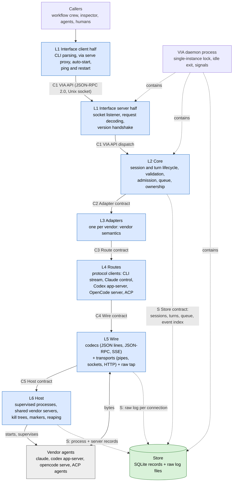

# VIA layers, contracts and naming options

Status: owner decisions 2026-09-25/26: set 1 for layer names with L2 renamed
Core, C1 renamed VIA API, and set 7 for code modules (§4). The options table
stays as history. Full design: `system-layers.md`.

## 1. Six layers, one contract per boundary

Every dependency points down; events and results flow back up through the
same contracts. Supervision is the bottom layer (Host), so no layer calls
"up" for services. The Store is a side component used by L2, L5 and L6.
The daemon is a process, not a seventh layer: it contains L1's server half,
L2–L6 and the Store. CLI, `via serve --stdio` and thin SDKs are L1 clients.

## 2. What each layer owns, and what it must never do

| Layer | Owns | Never does | Knows vendors? | Knows protocols? | Touches processes? |
|---|---|---|---|---|---|
| **L1 Interface** | Client half: CLI parsing, `via serve` proxy, auto-start, ping/restart. Server half: user-only socket listener, request decoding, version handshake, envelope formatting | Decide session lifecycle or access the Store as a client | no | C1 only | client starts daemon only |
| **L2 Core** | Session and turn states; canonical validation; model catalog; capability preflight; wall-clock and idle deadlines; admission across callers; per-session queues and limits; caller handle; envelope assembly; crash recovery decision | Map to vendor flags; parse vendor events; spawn processes | only by adapter name | no | no |
| **L3 Adapters** | Canonical → vendor mapping (verbs, parameters, permission bound, effort, instructions); capability declaration per route and version; version gate; failure classification; route choice per session; event normalization; automatic decline of vendor requests; vendor cancel sequence | Frame bytes; own processes; decide admission or ownership | yes, one each | uses a route's typed calls | no |
| **L4 Routes** | One protocol each: its messages, request/response pairing, server-to-client requests, session handles; generated types (Codex schema, OpenCode OpenAPI, ACP crate) | Vendor semantics beyond the protocol (e.g. what "read-only" means for a vendor) | only vendor-protocol routes, by protocol | yes, one each | no |
| **L5 Wire** | Framing (JSON lines, JSON-RPC 2.0, SSE); byte transport (pipes, Unix socket, WebSocket, HTTP); bounded pipe draining; exact-byte raw tap per connection | Interpret message meaning or block pipe reads on consumers | no | framing only | no; asks Host for an endpoint |
| **L6 Host** | Start and supervise processes in their own group; per-session process, private per-session server or shared server keyed by vendor, version, config hash and bound; health; timed escalation; VIA marker; orphan reporting; exit status | Speak any protocol; attach to or stop vendor servers VIA did not start; kill a shared server to cancel one turn | only how to start a binary | no | yes, the only layer that does |

## 3. The contracts

| Contract | Between | Crosses the boundary (down) | Comes back (up) | Stability |
|---|---|---|---|---|
| **C1 VIA API** | L1 clients ↔ L1 server half ↔ L2 | JSON-RPC 2.0 verbs: spawn, resume, steer, cancel, status, wait, result, list, logs; canonical parameters; capability query | result envelope; session and turn status; per-turn canonical event stream; named refusals | public, versioned (v1), deprecation rules |
| **C2 Adapter contract** | L2 ↔ L3 | canonical session and turn operations: start, continue, steer, interrupt, `close(mode, deadline)`; canonical parameters | canonical events in per-session order; declared capabilities; canonical failure classes; vendor session id | internal, stable, substitutable, conformance-tested |
| **C3 Route contract family** | L3 ↔ L4 | common: `open`, `close(mode, deadline)`, `health`; all other calls are typed per protocol | protocol messages and server requests; route capabilities | internal; common lifecycle, per-protocol calls |
| **C4 Wire contract** | L4 ↔ L5 | framed message send/receive; `close(mode, deadline)` | received messages; errors; end of stream | internal, small; request-id pairing belongs to L4 |
| **C5 Host contract** | L5 ↔ L6 | supervised process or private/shared server endpoint; signal; timed escalation; `close(mode, deadline)` | endpoint (pipes or connection); exit status; health; server loss | internal, small |
| **S Store contract** | L2, L5, L6 ↔ Store | L2: sessions, turns, queue, event index; L5: raw log append per connection; L6: process and server records | reads, short transactions; bounded lock waits | internal; daemon is sole writer |

`close(mode, deadline)` passes through C2–C5 to Host. Core decides what to
close; Host owns process termination. The OS file lock admits one daemon and
is released on process death. No per-turn leases, fencing or takeover
protocol exist. After a crash, Host reports surviving marked processes and
Core classifies in-flight turns as resumed, unknown or failed; an unknown
prompt is never resent automatically. L5 stores exact bytes with direction
and offsets per connection; L3/L4 split normalized events by vendor session
id into per-turn logs. `via logs` exposes only the requested session or turn.

## 4. Naming options

Each set names the six layers, the store and the five contracts.

| # | Theme | L1 | L2 | L3 | L4 | L5 | L6 | Store | Contracts C1 / C2 / C3 / C4 / C5 |
|---|---|---|---|---|---|---|---|---|---|
| 1 | Plain functional (recommended) | Interface | Run Core | Adapters | Routes | Wire | Host | Store | Run API / Adapter contract / Route contract / Wire contract / Host contract |
| 2 | Classic layered architecture | Presentation | Orchestration | Integration | Protocol | Transport | Runtime | Persistence | Public API / Integration SPI / Protocol SPI / Transport SPI / Runtime SPI |
| 3 | Verb per layer | Ask | Manage | Translate | Speak | Carry | Host | Record | Ask API / Translate contract / Speak contract / Carry contract / Host contract |
| 4 | Cloud-native (control plane, shims) | Gateway | Controller | Harness shims | Protocol clients | Channels | Supervisor | State store | Gateway API / Shim interface / Client interface / Channel interface / Supervisor interface |
| 5 | Agent-centric | Caller surface | Run manager | Agent adapters | Agent protocols | Links | Agent host | Run ledger | Caller API / Adapter API / Protocol API / Link API / Host API |
| 6 | Travel (VIA = "by way of") | Gate | Dispatch | Carriers | Routes | Lanes | Depot | Ledger | Gate API / Carrier contract / Route contract / Lane contract / Depot contract |
| 7 | Code-module names (Rust crates) | `via-cli` | `via-core` | `via-adapters` | `via-routes` | `via-wire` | `via-host` | `via-store` | `api` / `Adapter` trait / `Route` trait / `Channel` trait / `Host` trait |
| 8 | Function-descriptive | Surface | Coordination | Translation | Protocol | Framing and transport | Process | Record | Surface API / Translation contract / Protocol contract / Framing contract / Process contract |

Terms to avoid (glossary conflicts): *driver*, *plugin*, *profile* (banned
synonyms for adapter); *bridge* (means an ACP translator); *session* as a
layer name (clashes with vendor sessions); *connector* (clashes with Claude's
MCP connectors); *run* as a VIA lifecycle entity (retired; use session or
turn). Historical names in the options table are preserved as options.

## 5. Decision: set 1, code modules from set 7

- Layers: **Interface, Core, Adapters, Routes, Wire, Host**, plus **Store**.
  The **VIA daemon** is a process containing L1's server half, L2–L6 and
  Store; L1's client half lives in CLI, `via serve --stdio` and thin SDKs.
- Rule: a contract is named after the layer that **provides** it (Adapter
  contract, Route contract, Wire contract, Host contract, Store contract).
  The one exception is the public, versioned C1 **VIA API**, named for the
  product. C3 is a family with common `open`, `close`, `health` and protocol
  typed calls.
- Code modules follow set 7 (`via-core`, `via-adapters`, …), so the names in
  documents and in code match one to one.

Why: every name says what the layer does without a metaphor, keeps the
glossary's existing terms (*adapter*, *route*), and reads well to a
contributor who has never seen the project. Set 6 (travel) is the most
memorable and fits the project name, but metaphors cost every new reader a
translation step.
