# VIA system layers (design sketch)

Status: version 2, date 2026-09-26, integrates owner decisions D1–D9 and
layer-design review r1. **Decided** means an owner decision; **proposed** means
a detail to validate; **open** means undecided. Route choices are in
`routes-decision.md`.

## Names

| Layer | Code module | Owns | Never does |
|---|---|---|---|
| **L1 Interface** | `via-cli` | Client: CLI, `via serve --stdio` proxy, daemon auto-start, ping and restart. Server: socket listener, C1 decoding and version handshake | Vendor behavior or admission |
| **L2 Core** | `via-core` | Session and Turn lifecycle, validation, model catalog, capability preflight, admission, deadlines, per-session queue limits, caller handle, result envelope, recovery decisions | Vendor flags, protocol messages, processes |
| **L3 Adapters** | `via-adapters` | Vendor mapping, route and version choice, permission bound, capability declarations, automatic decline of server requests, vendor cancel sequence, event normalization | Framing, process ownership, admission |
| **L4 Routes** | `via-routes` | Typed protocol calls, request-id pairing and request deadlines, protocol events, vendor session id correlation | Vendor permission meaning |
| **L5 Wire** | `via-wire` | Codecs and transports, raw byte tap per connection, bounded pipe draining | Interpret messages or block pipe reads on consumers |
| **L6 Host** | `via-host` | Start, supervise and stop VIA-owned vendor processes; endpoint and exit observation; markers, process groups, timer escalation | Speak vendor protocols or allocate vendor sessions |
| **Store** (side) | `via-store` | SQLite records and append-only raw connection logs; only the daemon writes | Business logic |

| Contract | Between | Down | Up | Stability |
|---|---|---|---|---|
| **C1 VIA API** | clients ↔ L1 server ↔ L2 | spawn, resume, queue, steer, cancel, close, status, wait, result, list, logs, capability query; canonical parameters | receipts, envelopes, events, named refusals | public JSON-RPC 2.0, versioned v1 |
| **C2 Adapter contract** | L2 ↔ L3 | preflight, start, continue, steer, interrupt, `close(mode, deadline)` | canonical events, capabilities, failure classes, vendor session id | internal, substitutable boundary |
| **C3 Route contract** | L3 ↔ L4 | common `open`, `close`, `health`; other calls typed per protocol, including close mode and deadline | protocol events, server requests | internal family, not one universal verb set |
| **C4 Wire contract** | L4 ↔ L5 | framed messages, endpoint close mode and deadline | decoded messages, errors, end of stream | internal; request pairing belongs to L4 |
| **C5 Host contract** | L5 ↔ L6 | process or endpoint acquisition, signal, `close(mode, deadline)` | endpoints, exit status, process loss | internal; no vendor session abstraction |
| **S Store contract** | L2, L5, L6 ↔ Store | L2: sessions, turns, queue, events; L5: raw connection logs; L6: process records | reads and short writes | internal |

Rules:

1. Dependencies point down; results and events return up through the same
   contract. The Store is a side dependency, not a seventh layer. L4 and L5
   may share a package until reuse justifies a split.
2. A contract is named after the layer that provides it, except the public
   VIA API. The daemon is a process containing the layers, not a layer.
3. A Session keeps its route and adapter version for life, and stores its
   initial effective permission bound. Each Turn records its effective bound.
   Route fallback happens only before submitting Turn 1.
4. Adapters choose only routes that enforce the requested bound. Unsupported
   verbs are refused by name; a partial verb declares its semantics.
5. Roles are caller policy. VIA accepts explicit harness/model, effort,
   instructions, bound, cwd, output schema and namespaced vendor options.

## 0. The whole system

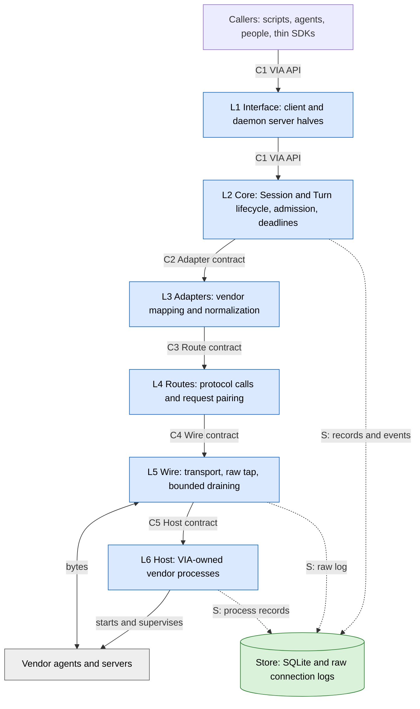

### Processes: the VIA daemon

One daemon per user owns all vendor processes and connections and is the
Store's only writer. `via` CLI, `via serve --stdio` and thin SDKs are clients;
none opens the Store. The CLI auto-starts the daemon on first use. The daemon
exits when idle. The one static Rust binary (stable 1.98.1, edition 2024)
exposes `via daemon ...` as a subcommand. A client/daemon version handshake
refuses mismatches. Library tests may assemble the layers in one process.

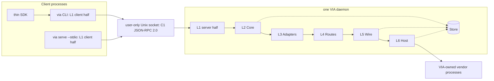

| Duty | Owner |
|---|---|
| Parse CLI, proxy `via serve`, auto-start daemon, ping with timeout and restart an unresponsive daemon | L1 client half |
| Listen on user-only socket, decode C1, check versions | L1 server half |
| Wire layers, hold OS single-instance file lock, handle idle exit and signals | daemon `main` only |
| Admit work, enforce deadlines and queues, decide crash recovery outcomes | L2 Core |
| Own vendor connections and processes | L5 Wire and L6 Host inside daemon |
| Write records and raw logs | Store, called only from daemon |

At startup the daemon takes an OS file lock (`std::fs::File::lock`); the OS
releases it on process death. After a crash the new daemon reads in-flight
Turns from the Store. Host reports surviving VIA-marked vendor processes;
Core decides whether each Turn is resumed, unknown or failed. An unknown
outcome remains `unknown` and is never submitted again automatically. A
client pings a hung but alive daemon with a timeout and restarts it. This
replaces the old one-worker-per-Turn process model.

## 1. Adapters are composed from routes

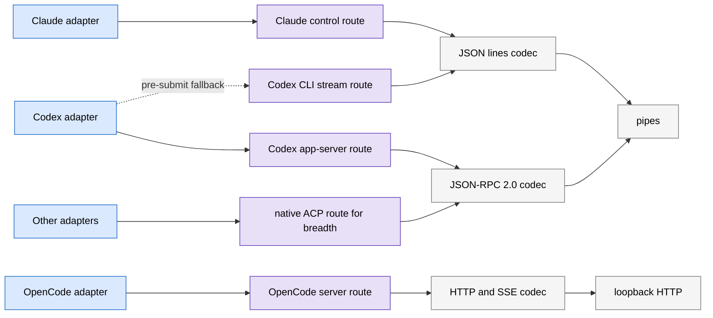

Use a vendor server where one exists, otherwise the vendor CLI. Native ACP
adds breadth; SDK and bridged ACP routes are deferred. `acpx` is not a runtime
dependency. VIA starts its own vendor servers and never attaches to or stops
servers it did not start. C2 is the substitutable boundary across adapters;
C3 exposes common `open`, `close` and `health` plus protocol-specific typed
calls.

| Codex adapter job | Example |
|---|---|
| Verb mapping | spawn maps to `thread/start` and `turn/start`; cancel to `turn/interrupt` |
| Permission mapping | `read-only` maps to a native sandbox and `approvalPolicy: never`; refuse an unenforceable bound |
| Parameter mapping | model, effort, instructions and namespaced vendor options |
| Capability and version gate | app-server may declare native steer; CLI route may refuse it; untested versions refuse or declare partial |
| Event and failure mapping | normalize text, tools, changes, usage and errors; retain unknown events |

## 2. End-to-end: a caller starts a Codex Session

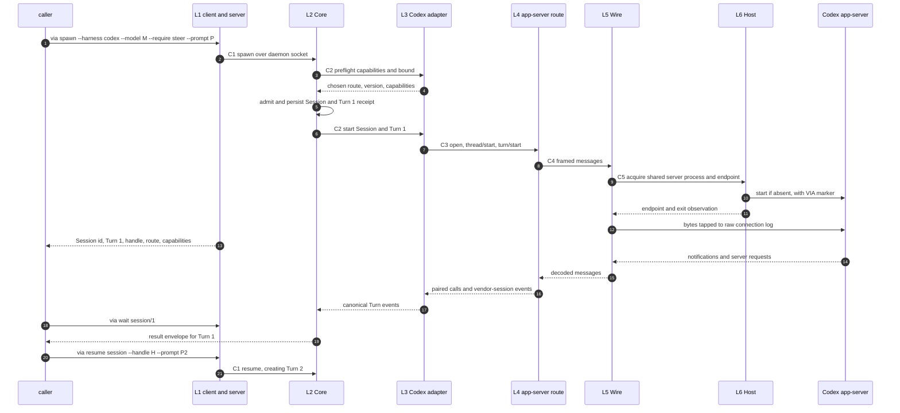

The caller handle is bearer authority for every Session mutation: resume,
queue, steer, cancel and close. Core stores only its hash. A client must
protect the handle; missing or wrong handles receive a named refusal.
Reading status or logs must still respect the caller's access boundary; the
handle must not leak through receipts, logs or another Session's events.

## 3. L1 Interface and C1 VIA API

The CLI presents `spawn`, `resume`, `queue`, `steer`, `cancel`, `close`, `status`, `wait`,
`result`, `list` and `logs` as human text or JSON. `via serve --stdio`
exposes the same C1 verbs plus event subscription. Thin SDKs speak through
the binary. C1 returns one result envelope per Turn: status, final text,
Session id and Turn number, usage, diff or change summary, and denied or
auto-declined actions. The spawn receipt names the chosen route, effective
bound and capabilities. `via logs` shows only the selected Session's or Turn's
normalized events, never another Session's traffic.

Canonical spawn parameters (the caller maps its roles onto these):

| Parameter | Form | Adapter behavior |
|---|---|---|
| harness and model | explicit harness/model or model via catalog | map to vendor model id |
| effort | canonical scale or vendor value | map or refuse unknown value |
| instructions | text or file | native instruction field, otherwise declared partial |
| permission bound | `read-only`, `workspace-write` with extra dirs, or `full`; network on/off | enforce natively or refuse; always use never-ask policy |
| cwd or worktree | path | native working directory |
| output schema | JSON Schema | native mapping or declared unsupported |
| vendor options | namespaced key/value | pass through as non-portable |
| required verbs | `--require <verbs>` | refuse by name before submission if route lacks any |

Capability preflight happens before admission. It reports each verb as
native, partial with semantics, or unsupported. A route fallback can happen
only before Turn 1 is submitted. ACP-only harnesses expose no sandbox, so
they declare only `full` bound. Over ACP, VIA advertises no client filesystem
or terminal capability.

## 4. L2 Core: Sessions and Turns

A **Session** is one caller-owned, resumable conversation with one agent and
one vendor session id (Codex thread, ACP session or Claude session). It keeps
its chosen route and adapter version for life. Its permission bound carries over
to every turn unchanged unless the caller explicitly sets a new one on resume
through the handle. Core revalidates the new bound against the route and records
it per turn; nothing changes it silently. It has a bounded queue. A **Turn** is
one caller prompt, the agent's steps and tool calls, and one result envelope.
It is addressed by Session id and number,
such as `s_7f3/2`. `spawn` creates Session and Turn 1; `resume` adds a Turn.
Steer and cancel target the active Turn. Claude `--max-turns` and `num_turns`
count model **steps** within one VIA Turn; VIA `max_steps` maps to that flag.

### 4.1 Admission and deadlines

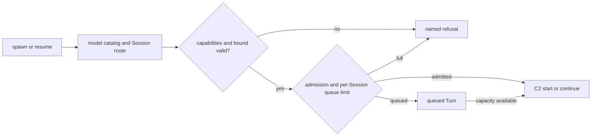

Core owns wall-clock and idle deadlines, queue limits and admission across
all clients. Every resume revalidates the effective bound; for example,
`codex exec resume` drops `-s`, so the adapter must restore or refuse it.
Bound changes are recorded per Turn and require the caller's handle. The
scope of permissible changes within one Session is an owner decision below.

### 4.2 Session state machine

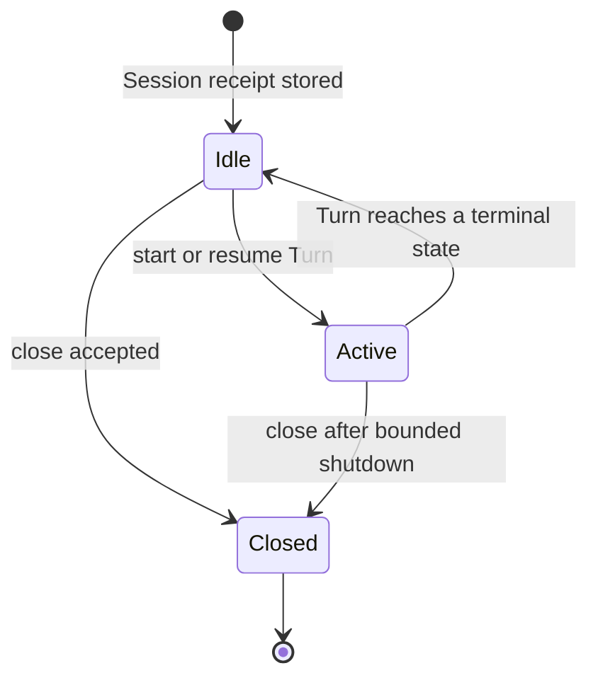

### 4.3 Turn state machine

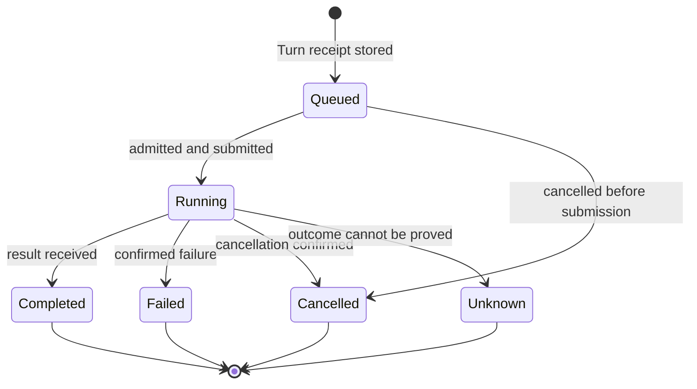

`unknown` is distinct from `failed` and never causes automatic resubmission.
Cancel progress is tracked separately as `requested`, `acknowledged`,
`forced`, or `unknown`; a requested cancel alone does not prove the Turn is
cancelled. Core starts the deadline, L3 runs the vendor's cancel sequence
(for Pi: clear queue, abort, wait for settle), and Host escalates by timer.
Never kill a shared server to cancel one Turn. `close(mode, deadline)` flows
through C2, C3, C4 and C5 to Host. For Oh My Pi, completion waits for
`session_settled`, not bare `agent_end`.

## 5. L3 Adapter internals and server requests

An adapter maps canonical operations and bounds to a chosen route, gates
vendor versions, normalizes events and classifies failures. The route is
fixed for the Session. L4 pairs protocol request ids and enforces a reply
deadline; L3 supplies an automatic decline for every vendor server request,
including unknown types. Examples include Codex `item/tool/requestUserInput`,
`mcpServer/elicitation/request`, `item/tool/call` and approval requests; ACP
`session/request_permission`; and Cursor blocking question or plan requests.
L3 emits a canonical event for each decline. The denied action or declined
request appears in the Turn result. This is protocol hygiene under the
never-ask policy, not a separate VIA permission layer.

Each Session starts with actions outside its bound denied, not escalated to a
human prompt: Codex uses `approvalPolicy: never` plus a sandbox; Claude
headless omits `--permission-prompt-tool`. The agent sees the denial and can
finish the Turn. The caller then chooses a new prompt, explicitly sets a new
bound on resume through the handle, or stops. Two-way transport remains
necessary for cancel, steer and automatic declines.

## 6. L6 Host: operating-system processes

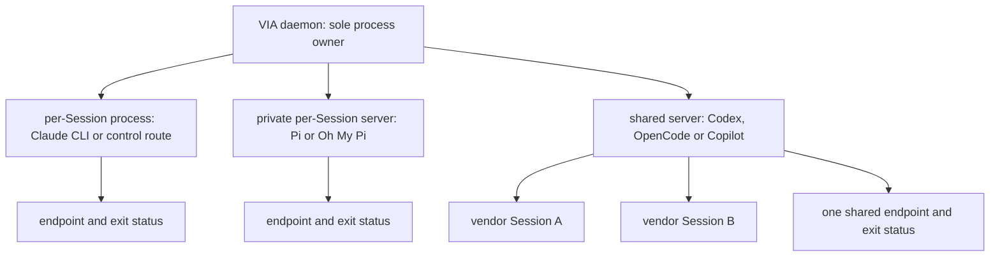

The shared-server key is `(vendor, version, config hash, bound)`. The daemon
chooses and starts servers, so no cross-process start claim is needed. Host
returns a process, endpoint and exit observations, never a vendor Session.
Routes and adapters correlate Sessions over a shared connection. Host uses
VIA markers and process groups, observes exits, enforces close deadlines and
stops only processes VIA started. Idle Claude Session processes close after
a configured number of idle minutes; later resume starts a fresh process on
the same route. The transport of a shared server (stdio or Unix socket)
remains open.

## 7. Store and the two logs

### 7.1 Write order and retention

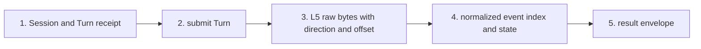

SQLite holds queryable records; append-only files hold bulk raw bytes. L5
writes one raw log **per connection**, preserving exact bytes with direction
and offsets. A shared Codex app-server connection has interleaved traffic
for several vendor threads. L4/L3 use vendor session ids to direct normalized
events into **per-Turn event logs**. Core assigns a sequence number within
each Turn when persisting events. C2 guarantees order within a Session only.
Events can reference a connection id and raw offset; `via logs` filters the
event log, never exposes the entire shared raw log to a Session caller. A
one-process-per-Session route has one connection, so the logs align simply.

Store writes use short transactions, never spanning vendor I/O, with bounded
lock waits and explicit disk-full failure handling. Retention must set limits
for raw bytes, normalized events, receipts and envelopes while preserving
references or reporting pruned offsets. A concrete retention period and
capacity remain open. The vendor's own transcript stays the vendor's record
and is not copied. L5 drains every pipe into bounded buffers without waiting
for event consumers; overload is surfaced and handled without blocking reads.

### 7.2 Records

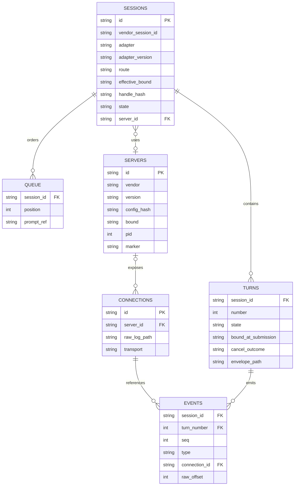

## 8. Vendor agents and isolation

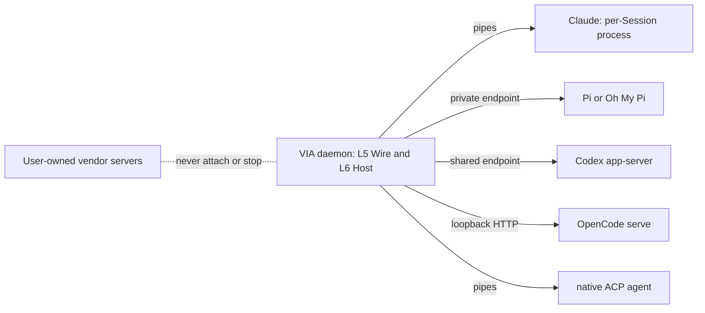

The vendor tool owns login and credentials; VIA does not read or copy them.
VIA does not attach to user-owned servers. Isolation is route-specific and
must be declared in the spawn receipt; a shared server key includes the
bound so Sessions with different bounds do not share it. Whether VIA may
wrap a vendor server in an external sandbox is still open.

## Open items

1. May VIA wrap a vendor server in an external sandbox, such as `bwrap` for
   OpenCode when no native bound exists?
2. Should shared vendor servers attach over stdio (simpler) or a Unix socket
   (a server could survive daemon death and be rejoined)?
3. Testing policy details remain for owner discussion; end-to-end-first is
   the current direction.
4. Set concrete buffer, queue, deadline, idle-exit and retention limits after
   measurement. Probe vendor-specific storage isolation and thread visibility
   before relying on them.
